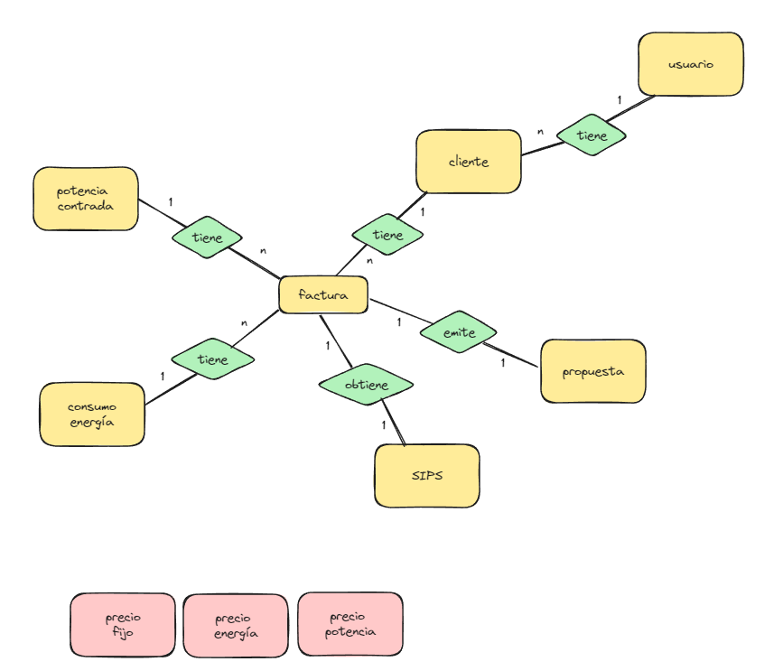
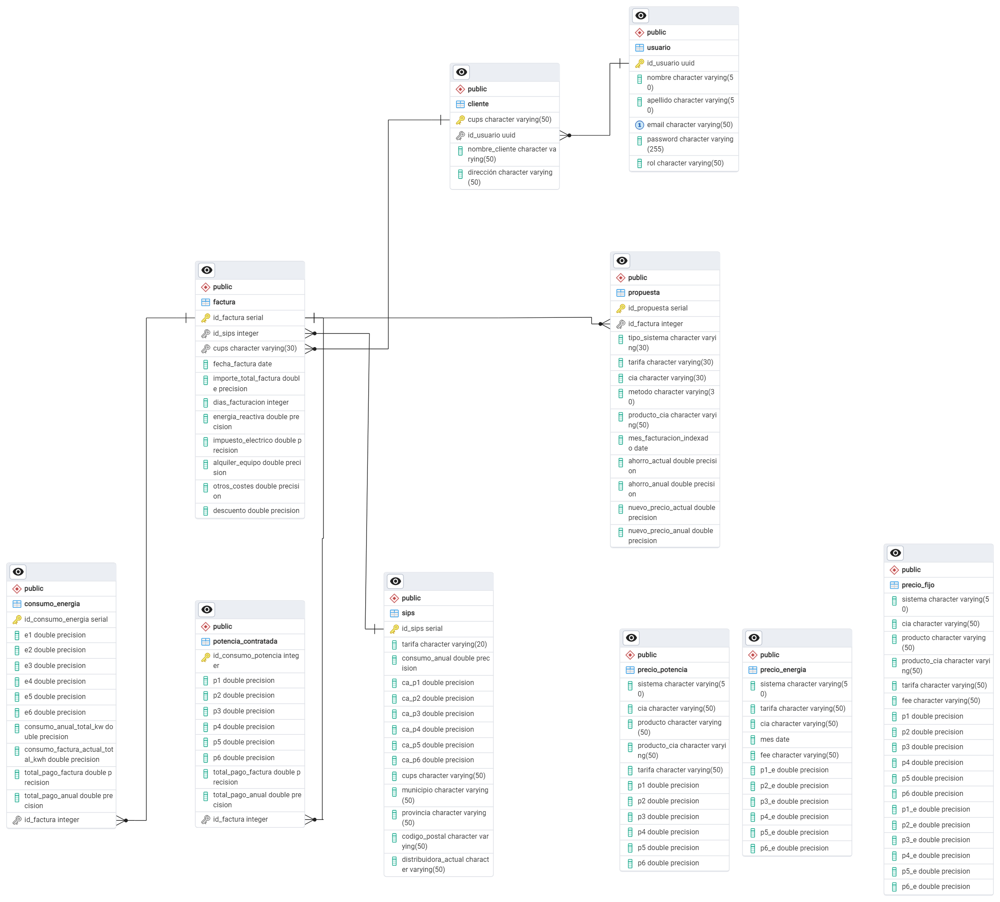

# **Desafío de tripulaciones The Bridge**

#### *Steven Noboa, Daniel Rendón Gouveia, Guillermo Pereda, Matias Ibarra - Bootcamp Data Science - The Bridge School - Año 2023/2024*

### 🎯 Alcance del Proyecto
- Creación de BBDD con PostgreSQL alojada en el servicio cloud de Google BigQuery.
- Creación de tablas y posterior normalización para mejorar la escalabilidad.
- Ingesta automática de datos mediante el backend de la web.
- WebScraping de la web de Candela para obtención de datos mediante el CUPS del cliente y posterior autorellenado de las planillas de propuestas.

### 📄 Fases del Proyecto
- Establecimiento de un modelo lógico para conectar las distintas tablas que compondrán la BBDD

***
Creación de tablas mediante queries SQL:

[Archivo de queries](./BBDD/notebooks/queries_SQL.ipynb)

"""
CREATE TABLE ENERGIA (
    SISTEMA VARCHAR(50),
    TARIFA VARCHAR(50),
    CIA VARCHAR(50),
    mes DATE,
    FEE VARCHAR(50),
    P1_e FLOAT,
    P2_e FLOAT,
    P3_e FLOAT,
    P4_e FLOAT,
    P5_e FLOAT,
    P6_e FLOAT
);

CREATE TABLE POTENCIA (
    Sistema VARCHAR(50),
    CIA VARCHAR(50),
    PRODUCTO VARCHAR(50),
    PRODUCTO_CIA VARCHAR(50),
    Tarifa VARCHAR(50),
    P1 FLOAT,
    P2 FLOAT,
    P3 FLOAT,
    P4 FLOAT,
    P5 FLOAT,
    P6 FLOAT
);

CREATE TABLE Fijo (
    sistema VARCHAR(50),
    cia VARCHAR(50),
    producto VARCHAR(50),
    producto_cia VARCHAR(50),
    tarifa VARCHAR(50),
    fee VARCHAR(50),
    P1 FLOAT,
    P2 FLOAT,
    P3 FLOAT,
    P4 FLOAT,
    P5 FLOAT,
    P6 FLOAT,
    P1_e FLOAT,
    P2_e FLOAT,
    P3_e FLOAT,
    P4_e FLOAT,
    P5_e FLOAT,
    P6_e FLOAT
);

CREATE TABLE Usuario (
    ID_Usuario UUID PRIMARY KEY,
    Email VARCHAR(50) UNIQUE,
    Contraseña VARCHAR(20),
    Rol VARCHAR(50)
);

CREATE TABLE Cliente (
    CUPS VARCHAR(50) PRIMARY KEY,
    ID_Usuario UUID,
    Nombre_cliente VARCHAR(50),
    Dirección VARCHAR(50),
    FOREIGN KEY (ID_Usuario) REFERENCES Usuario(ID_Usuario)
);

CREATE TABLE sips (
    ID_sips SERIAL PRIMARY KEY,
    tarifa VARCHAR(20),
    Consumo_anual FLOAT,
    ca_p1 FLOAT,
    ca_p2 FLOAT,
    ca_p3 FLOAT,
    ca_p4 FLOAT,
    ca_p5 FLOAT,
    ca_p6 FLOAT,
    CUPS VARCHAR (50),
    Municipio VARCHAR(50),
    Provincia VARCHAR(50),
    Codigo_postal VARCHAR(50),
    Distribuidora_actual VARCHAR(50)
);

CREATE TABLE Consumo_Energia (
    ID_Consumo_Energia SERIAL PRIMARY KEY,
    ID_Factura INT,
    E1 FLOAT,
    E2 FLOAT,
    E3 FLOAT,
    E4 FLOAT,
    E5 FLOAT,
    E6 FLOAT,
    Consumo_Anual_Total_KW FLOAT,
    Consumo_Factura_Actual_Total_KWh FLOAT,
    Total_Pago_Factura FLOAT,
    Total_Pago_Anual FLOAT
);

CREATE TABLE Consumo_potencia (
    ID_Consumo_Potencia SERIAL PRIMARY KEY,
    ID_Factura INT,
    P1 FLOAT,
    P2 FLOAT,
    P3 FLOAT,
    P4 FLOAT,
    P5 FLOAT,
    P6 FLOAT,
    Consumo_Anual_Total_KW FLOAT,
    Consumo_Factura_Actual_Total_KWh FLOAT,
    Total_Pago_Factura FLOAT,
    Total_Pago_Anual FLOAT
);

CREATE TABLE Factura (
    ID_Factura SERIAL PRIMARY KEY,
    ID_sips INT,
    ID_Consumo_Energia INT,
    ID_Consumo_Potencia INT,
    CUPS VARCHAR(30),
    Fecha_Factura DATE,
    Importe_Total_Factura FLOAT,
    Días_facturación INT,
    Energia_reactiva FLOAT,
    Impuesto_eléctrico FLOAT,
    Alquiler_equipo FLOAT,
    Otros_costes FLOAT,
    Descuento FLOAT,
    FOREIGN KEY (ID_sips) REFERENCES sips(ID_sips),
    FOREIGN KEY (ID_Consumo_Energia) REFERENCES Consumo_Energia(ID_Consumo_Energia),
    FOREIGN KEY (ID_Consumo_Potencia) REFERENCES Consumo_potencia(ID_Consumo_Potencia),
    FOREIGN KEY (CUPS) REFERENCES Cliente(CUPS)
);

CREATE TABLE Propuesta (
    ID_Propuesta SERIAL PRIMARY KEY,
    ID_Usuario INT,
    ID_Factura INT,
    ID_Cia INT,
    ID_sips INT UNIQUE,
    Detalles_Propuesta VARCHAR(50),
    Total_Pago_Propuesto FLOAT,
    FOREIGN KEY (ID_Factura) REFERENCES Factura(ID_Factura)
);

"""

***

- Diagrma Entidad-Relación:

## WebScraping de la web de Candela

El archivo [App](./webscrapping/app/src/app.py) contiene el código que ejecuta el webscrapeo.

...

@app.route('/result', methods=['POST'])
def result():
    cups = request.form.get('cups')
    df = webscrape(cups)
    cups_m = df.iloc[0]['cups']
    cups = cups_m
    if df is not None:
        df = convertir_df(df, columnas_a_convertir)
        insertar_datos(df)
        mensaje = 'Datos ingresados correctamente'
    else:
        mensaje = 'No se obtuvieron datos para el CUPS proporcionado'

    return jsonify({'mensaje': mensaje, 'cups': cups})

...

Este código define una ruta ('/result') en una aplicación web Flask que maneja solicitudes POST. Cuando se recibe una solicitud en esta ruta, el código extrae el CUPS del formulario de la solicitud. Luego utiliza este valor para realizar un webscraping con la función webscrape(), obteniendo un DataFrame (df). Posteriormente, verifica si el DataFrame no es nulo e inserta los datos resultantes la tabla 'sips' (función insertar_datos()).

...

@app.route('/datos/<cups>', methods=['GET'])
def obtener_datos(cups):
    engine = create_engine(servidor)
    query = "SELECT * FROM sips WHERE cups = %(cups)s"
    df = pd.read_sql(query, engine, params={'cups': cups})

    if df.empty:
        return jsonify({"error": "No se encontraron datos para el CUPS proporcionado"}), 404
    else:
        return jsonify(df.to_dict(orient='records'))

Este código obtiene los datos extraídos y los devuelve en formato JSON.

[Funciones](./webscrapping/app/src/funciones.py)

[Variables](./webscrapping/app/src/variables.py)